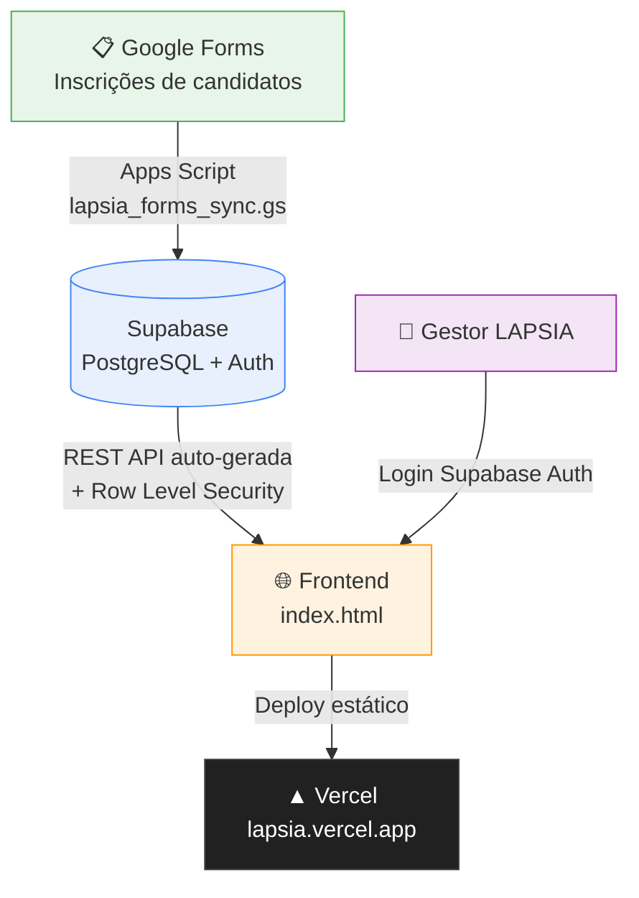

<div align="center">
<br />

<svg width="64" height="64" viewBox="0 0 24 24" fill="none" stroke="#7B6CF6" stroke-width="1.6" stroke-linecap="round" stroke-linejoin="round" xmlns="http://www.w3.org/2000/svg">
  <path d="M9.5 2a5.5 5.5 0 0 0-4.9 8.02A4.5 4.5 0 0 0 6 18.5V20a2 2 0 0 0 2 2h1v-3M14.5 2a5.5 5.5 0 0 1 4.9 8.02A4.5 4.5 0 0 1 18 18.5V20a2 2 0 0 1-2 2h-1v-3M9.5 2c1.4 0 2.5 1.6 2.5 3.5S10.9 9 9.5 9M14.5 2c-1.4 0-2.5 1.6-2.5 3.5"/>
</svg>

# LAPSIA · Sistema de Gestão

**Liga Acadêmica de Psicologia Ampliada — UNITRI, Uberlândia MG**

<br />

[](#)
[](#)
[](#)
[](#)
[](#)

[](#)
[](#)

</div>

---

## 📌 Sobre o Projeto

A **LAPSIA** é a Liga Acadêmica de Psicologia Ampliada da UNITRI. Este sistema transforma um processo antes manual — inscrições em Google Forms, controle de presença em planilhas, comunicações por WhatsApp sem rastreio — em um painel de gestão centralizado com banco de dados real, autenticação e sincronização automática.

### O problema

Sem um sistema centralizado, a equipe da LAPSIA enfrentava:

- Inscrições de candidatos espalhadas em planilhas sem histórico de status
- Processo seletivo (triagem → rubrica → entrevista → devolutiva) controlado manualmente
- Presença e frequência registradas sem alertas automáticos de infrequência
- Certificados gerados um a um, sem dados consolidados

### A solução

Um dashboard completo construído sobre o Supabase (banco + auth + API), acessível pelo browser, sem necessidade de servidor dedicado.

---

## 🛠️ Stack Técnica

| Camada | Tecnologia | Papel |
|--------|-----------|-------|
| Banco de dados | **Supabase** (PostgreSQL) | 17 tabelas, RLS, Auth integrado |
| Frontend | **HTML + CSS + JavaScript** | Dashboard navegável, sem framework |
| Hospedagem | **Vercel** | Deploy estático, HTTPS automático |
| Sincronização | **Google Apps Script** | Importa inscrições do Forms → Supabase |
| Geração de docs | **PptxGenJS** | Exportação de relatórios |

> **Custo estimado:** R$ 0 a R$ 7/mês para o volume atual (~5 usuários gestores).

---

## 🏗️ Arquitetura



### Fluxo de dados

```
Candidato preenche Form
        ↓
Google Sheets (planilha vinculada)
        ↓
Apps Script → upsert em `pessoas` + insert em `inscricoes`
        ↓
Supabase (banco de dados)
        ↓
Dashboard (fetch em tempo real) → Andressa gerencia o processo seletivo
```

---

## ✅ Funcionalidades

### Implementadas

- [x] **Autenticação real** via Supabase Auth (login/logout com sessão persistente)
- [x] **Importação automática** de inscrições do Google Forms para o banco
- [x] **Deduplicação inteligente** — mesmo candidato resubmetendo o form não gera duplicata
- [x] **Seleção de Ligantes** — listagem em tempo real com filtros por opção, turno e semestre
- [x] **Núcleos suportados** — Logoterapia, Morte e Luto, Psicologia Escolar, Liga Ampliada
- [x] **Separação de responsabilidades** — HTML, CSS e JS em arquivos independentes
- [x] **Segurança por RLS** — usuários autenticados têm acesso; dados protegidos no banco

### Em desenvolvimento

- [ ] **Deploy no Vercel** — acesso via URL pública para a equipe
- [ ] **Persistência de rubricas** — avaliações salvas no banco (hoje ficam só na sessão)
- [ ] **Fluxo seletivo completo** — atualização de status (triagem → aprovado → entrevista → devolutiva)
- [ ] **Certificados** — geração de PDF personalizado por ligante aprovado
- [ ] **Frequência** — controle de presença com alerta automático de infrequência
- [ ] **Módulo de eventos** — gestão de eventos externos e palestrantes

---

## 📁 Estrutura do Projeto

```
lapsia-gestao/
│
├── index.html                  # HTML da aplicação (sem JS ou CSS inline)
│
├── css/
│   └── style.css               # Todos os estilos (629 linhas)
│
├── js/
│   ├── config.js               # Supabase client, ICON, OPCOES_CONFIG, constantes
│   ├── db.js                   # LAPSIA_DB — dados de exemplo (substituição gradual)
│   ├── overlay.js              # CURADORIA_OVERLAY, MSG_CONFIG, utilitários de sessão
│   ├── data.js                 # Funções de acesso ao banco (fetchCuradoria, etc.)
│   ├── app.js                  # Estado, navegação e autenticação
│   ├── render.js               # Todas as funções de render e modais
│   ├── boot.js                 # Inicialização da aplicação
│   └── vendor/
│       └── pptxgen.min.js      # PptxGenJS 3.12.0 (MIT) — geração de .pptx
│
├── lapsia_schema.sql           # Schema completo: 17 tabelas + dados iniciais
├── lapsia_forms_sync.gs        # Google Apps Script — sincronização Forms → Supabase
└── .gitignore
```

---

## 🚀 Setup

### Pré-requisitos

- Conta no [Supabase](https://supabase.com) (plano gratuito suficiente)
- Acesso à planilha do Google Forms da LAPSIA (para o Apps Script)

### 1. Banco de dados

```bash
# No SQL Editor do Supabase:
# Abra lapsia_schema.sql e execute o conteúdo completo
# Isso cria as 17 tabelas + insere dados iniciais (diretorias e núcleos)
```

Em seguida, ative o **Row Level Security**:
- Table Editor → selecione cada tabela → Enable RLS
- Adicione a política: `authenticated` pode fazer tudo (fase inicial)

### 2. Frontend

```bash
git clone https://github.com/seu-usuario/lapsia-gestao.git
cd lapsia-gestao

# Abra index.html no browser (sem build step necessário)
# Ou suba direto no Vercel: vercel deploy
```

### 3. Sincronização do Google Forms

1. Abra a planilha vinculada ao Forms da LAPSIA
2. **Extensões → Apps Script** → cole o conteúdo de `lapsia_forms_sync.gs`
3. No Supabase → **Authentication → Users → Add user** crie um usuário de sincronização
4. No script, preencha as variáveis:

```javascript
const SYNC_EMAIL = "seu-usuario-sync@dominio.com";
const SYNC_SENHA = "senha-definida-no-supabase";
```

5. Execute a função `sincronizarInscricoes`

> ⚠️ **Segurança:** `SYNC_EMAIL` e `SYNC_SENHA` ficam **somente no Apps Script**, nunca no repositório.
> A chave `sb_publishable_...` é pública por design (Supabase a chama de "publishable" por isso).

---

## 🗺️ Roadmap

```
2026.2 — Semestre atual
│
├── ✅ Fase 1 — Infraestrutura
│   ├── Schema do banco (17 tabelas)
│   ├── Autenticação real
│   └── Importação do Google Forms
│
├── ✅ Fase 2 — Dashboard conectado
│   ├── Tela de Seleção de Ligantes com dados reais
│   └── Reestruturação do código (HTML/CSS/JS separados)
│
├── 🚧 Fase 3 — Processo seletivo
│   ├── Persistência de rubricas no banco
│   ├── Atualização de status dos candidatos
│   └── Deploy no Vercel
│
└── 🔜 Fase 4 — Ciclo de vida do ligante
    ├── Controle de frequência e presença
    ├── Geração de certificados
    └── Módulo de eventos externos
```

---

## 👥 Equipe

| Papel | Pessoa |
|-------|--------|
| Gestora LAPSIA / Product Owner | Andressa dos Santos Machado |
| Desenvolvimento | João Rodrigues (Sankhya) |
| IA de desenvolvimento | Claude (Anthropic) |

---

## 🏛️ Sobre a LAPSIA

A Liga Acadêmica de Psicologia Ampliada da UNITRI integra estudantes de Psicologia em núcleos temáticos de pesquisa e extensão: **Logoterapia**, **Morte e Luto** e **Psicologia Escolar**, além da **Liga Ampliada** — trilha de formação complementar aberta a todos os semestres.

---

<div align="center">
<sub>Desenvolvido com 💜 para a LAPSIA · UNITRI · Uberlândia MG · 2026</sub>
</div>
